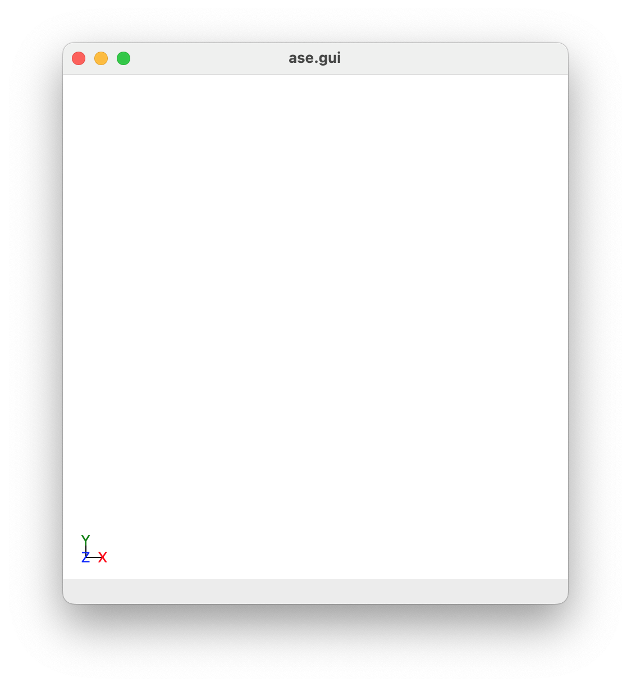

.. _Installation:

Installation: Setting Up ECCP and Pre-Requisites Packages
#########################################################

In this article, we will look at how to install the ECCP and all requisites required for this program.

Pre-requisites
==============

Python 3 and ``pip3``
---------------------

This program is designed to work with **Python 3**. While this program has been designed to work with Python 3.6, it should work with any version of Python 3 that is the same or later than 3.6.

To find out if you have Python 3 on your computer and what version you have, type into the terminal

.. code-block:: bash

	python --version

If you have Python 3 on your computer, you will get the version of python you have on your computer. E.g.

.. code-block:: bash

	user@Apple-Mini path % python --version
	Python 3.6.3

If you have Python 3, you may have ``pip`` installed on your computer as well. ``pip`` is a python package installation tool that is recommended by Python for installing Python packages. To see if you have ``pip`` installed, type into the terminal

.. code-block:: bash

	pip list

If you get back a list of python packages install on your computer, you have ``pip`` installed. E.g.

.. code-block:: bash

	geoffreyweal@Geoffreys-Mini Documentation % pip3 list
	Package                       Version
	----------------------------- ---------
	alabaster                     0.7.12
	asap3                         3.11.10
	ase                           3.20.1
	Babel                         2.8.0
	certifi                       2020.6.20
	chardet                       3.0.4
	click                         7.1.2
	cycler                        0.10.0
	docutils                      0.16
	Flask                         1.1.2
	idna                          2.10
	imagesize                     1.2.0
	itsdangerous                  1.1.0
	Jinja2                        2.11.2
	kiwisolver                    1.2.0
	MarkupSafe                    1.1.1
	matplotlib                    3.3.1
	numpy                         1.19.1
	packaging                     20.4
	Pillow                        7.2.0
	pip                           20.2.4
	Pygments                      2.7.1
	pyparsing                     2.4.7
	python-dateutil               2.8.1
	pytz                          2020.1
	requests                      2.24.0
	scipy                         1.5.2
	setuptools                    41.2.0
	six                           1.15.0
	snowballstemmer               2.0.0
	Sphinx                        3.2.1
	sphinx-pyreverse              0.0.13
	sphinx-rtd-theme              0.5.0
	sphinx-tabs                   1.3.0
	sphinxcontrib-applehelp       1.0.2
	sphinxcontrib-devhelp         1.0.2
	sphinxcontrib-htmlhelp        1.0.3
	sphinxcontrib-jsmath          1.0.1
	sphinxcontrib-plantuml        0.18.1
	sphinxcontrib-qthelp          1.0.3
	sphinxcontrib-serializinghtml 1.1.4
	sphinxcontrib-websupport      1.2.4
	urllib3                       1.25.10
	Werkzeug                      1.0.1
	wheel                         0.33.1
	xlrd                          1.2.0

If you do not see this, you probably do not have ``pip`` installed on your computer. If this is the case, check out `PIP Installation <https://pip.pypa.io/en/stable/installing/>`_. 

Atomic Simulation Environment (ASE)
-----------------------------------

The Electronic Crystal Calculation Prep program uses the Atomic Simulation Environment (ASE) to read in the crystal data from various file format, to process the crystals, and to save the molecules and dimers found in the crystal to the preferred file type. Read more about `ASE here <https://wiki.fysik.dtu.dk/ase/>`_. 

The installation of ASE can be found on the `ASE installation page <https://wiki.fysik.dtu.dk/ase/install.html>`_, however from experience if you are using ASE for the first time, it is best to install ASE using ``pip``, the package manager that is an extension of python to keep all your program easily managed and easy to import into your python. 

To install ASE using ``pip``, perform the following in your terminal.

.. code-block:: bash

	pip install --upgrade --user ase

Installing using ``pip`` ensures that ASE is being installed to be used by Python 3, and not Python 2. Installing ASE like this will also install all the requisite program needed for ASE. This installation includes the use of features such as viewing the xyz files of structure and looking at ase databases through a website. These should be already assessible, which you can test by entering into the terminal:

.. code-block:: bash

	ase gui

This should show a gui with nothing in it, as shown below.

   This is a blank ase gui screen that you would see if enter ``ase gui`` into the terminal.

However, **in the case that this does not work**, we need to manually add a path to your ``~/.bashrc`` so you can use the ASE features externally outside python. Do the following; first enter the following into the terminal:

.. code-block:: bash

	pip show ase

This will give a bunch of information, including the location of ase on your computer. For example, when I do this I get:

.. code-block:: bash

	Geoffreys-Mini:~ geoffreyweal$ pip show ase
	Name: ase
	Version: 3.20.1
	Summary: Atomic Simulation Environment
	Home-page: https://wiki.fysik.dtu.dk/ase
	Author: None
	Author-email: None
	License: LGPLv2.1+
	Location: /Users/geoffreyweal/Library/Python/3.6/lib/python/site-packages
	Requires: matplotlib, scipy, numpy
	Required-by: 

Copy the 'Location' line. If we remove the 'lib/python/site-packages' bit and replace it with 'bin', this gives us the location of useful ASE programs. The example below is for Python 3.6. 

.. code-block:: bash

	/Users/geoffreyweal/Library/Python/3.6/bin

Next, add this to your ``~/.bashrc`` file as below:

.. code-block:: bash

	############################################################
	# For ASE
	export PATH=/Users/geoffreyweal/Library/Python/3.6/bin:$PATH
	############################################################

Write ``source ~/.bashrc`` in the terminal and press enter. Once you have done this, try to run ``ase gui`` in the terminal. This will hopefully show the ase gui and allow you to access the useful ASE programs through the terminal. 

Networkx
--------

``Networkx`` is a python program that is used in the Electronic Crystal Calculation Prep program to determine individual molecules in a crystal structure, as well as to help reconstructure molecules in the crystal into more human-friendly versions. The easiest way to install ``Networkx`` is though ``pip``. Type the following into the terminal:

.. code-block:: bash

	pip install --upgrade --user networkx

Pymatgen
--------

``Pymatgen`` is a python program that is used in the Electronic Crystal Calculation Prep program to determine symmetric molecules within a crystal structure. The easiest way to install ``Pymatgen`` is though ``pip``. Type the following into the terminal:

.. code-block:: bash

	pip install --upgrade --user pymatgen

This package and other required packages may take a bit of time to install. 

Packaging
---------

The ``packaging`` program is also used in this program to check the versions of ASE that you are using for compatibility issues. The easiest way to install ``packaging`` is though ``pip``. Type the following into the terminal:

.. code-block:: bash

	pip install --upgrade --user packaging

TQDM
----

The ``tqdm`` program is used by this program to provide progress bars that are useful for easily monitoring progress during this program. The easiest way to install ``tqdm`` is though ``pip``. Type the following into the terminal:

.. code-block:: bash

	pip install --upgrade --user tqdm

Xlsxwriter
----------

The ``xlsxwriter`` program is used by this program to write the output data from Gaussian jobs to an excel file(s). The easiest way to install ``xlsxwriter`` is though ``pip``. Type the following into the terminal:

.. code-block:: bash

	pip3 install --upgrade --user xlsxwriter

Xlsxwriter
----------

The ``memory_profiler`` program is a really useful program for determining how much memory is being used by a python program or any program using python. It is used here to determine how much memory is being used to process matrix data from ``output.log`` files. The easiest way to install ``memory_profiler`` is though ``pip``. Type the following into the terminal:

.. code-block:: bash

	pip3 install --upgrade --user memory_profiler

Multiwfn
--------

Multiwfn is a program that is designed to determine the charge of atoms in a molecule from a ``.wfn`` file obtained from Gaussian. This program is required if you are wanting to perform Atomic Transition Charge (ATC) calculations. To install this program in a Unix based operating system (Unix or MacOS):

1. Download 3.8(dev)/Multiwfn_3.8_dev_bin_Linux_noGUI.zip from https://mega.nz/folder/HVcjECZS#rGG6dCO57AwpdCgYaQ3apg
2. Unzip it in the place you want to hold it on your computer on on the computer cluster.
3. Write ``pwd`` into the terminal where you unzipped the file (for example: ``/nfs/home/wealge/Multiwfn/Multiwfn_3.8_dev_bin_Linux_noGUI``)
4. Write the following into your bashrc file (by writing ``vim ~/.bashrc`` into the terminal):

To add into your bashrc

.. code-block:: bash

	###################################
	# Multiwfn stuff
	export KMP_STACKSIZE=200M
	ulimit -s unlimited

	export Multiwfnpath='WRITE/HERE/THE_PATH_TO_YOUR_Multiwfn_DIRECTORY'
	export PATH=$Multiwfnpath:$PATH
	###################################

For example:

.. code-block:: bash

	###################################
	# Multiwfn stuff
	export KMP_STACKSIZE=200M
	ulimit -s unlimited

	export Multiwfnpath='/nfs/home/wealge/Multiwfn/Multiwfn_3.8_dev_bin_Linux_noGUI'
	export PATH=$Multiwfnpath:$PATH
	###################################

5. Source the bashrc file (by writing ``source ~/.bashrc`` into the terminal)

To check that you can run this program in the terminal write ``cd`` in the terminal, and then write ``Multiwfn`` in the terminal. If the program is working, the ``Multiwfn`` will begin and you will see the following message:

.. code-block:: bash

	Multiwfn -- A Multifunctional Wavefunction Analyzer
	Version 3.8(dev), release date: 2022-Apr-2
	Developer: Tian Lu (Beijing Kein Research Center for Natural Sciences)
	Below paper ***MUST BE CITED*** if Multiwfn is utilized in your work:
	        Tian Lu, Feiwu Chen, J. Comput. Chem., 33, 580-592 (2012)
	See "How to cite Multiwfn.pdf" in Multiwfn binary package for more information
	Multiwfn official website: http://sobereva.com/multiwfn
	Multiwfn English forum: http://sobereva.com/wfnbbs
	Multiwfn Chinese forum: http://bbs.keinsci.com/wfn

To cancel out of this, type ``ctrl + c`` or ``ctrl + z`` into the terminal and this should exit out of the program.

See http://sobereva.com/multiwfn/ and the ``Multiwfn_3.8_dev.pdf`` file in https://mega.nz/folder/HVcjECZS#rGG6dCO57AwpdCgYaQ3apg (Chapter 2.1.2) for more information about how to install Multiwfn on your system.

Setting up the Electronic Crystal Calculation Prep program
==========================================================

There are three ways to install ECCP on your system. These ways are described below:

Install ECCP through ``pip3``
-----------------------------

To install the ECCP program using ``pip3``, perform the following in your terminal.

.. code-block:: bash

	pip3 install --upgrade --user ECCP

The website for ECCP on ``pip3`` can be found by clicking the button below:

.. image:: https://img.shields.io/pypi/v/ECCP
   :target: https://pypi.org/project/ECCP/
   :alt: PyPI

Install ECCP through ``conda``
------------------------------

You can also install ECCP through ``conda``, however I am not as versed on this as using ``pip3``. See `docs.conda.io <https://docs.conda.io/projects/conda/en/latest/user-guide/tasks/manage-pkgs.html>`_ to see more information about this. Once you have installed anaconda on your computer, I believe you install ECCP using ``conda`` by performing the following in your terminal.

.. code-block:: bash

	conda install ase
	conda install eccp

The website for ECCP on ``conda`` can be found by clicking the button below:

.. image:: https://img.shields.io/conda/v/geoffreyweal/eccp
   :target: https://anaconda.org/geoffreyweal/eccp
   :alt: Conda

Manual installation
-------------------

First, download the Electronic Crystal Calculation Prep program to your computer. You can do this by cloning a version of this from Github, or obtaining a version of the program from the authors. If you are obtaining this program via Github, you want to ``cd`` to the directory that you want to place this program in on the terminal, and then clone the program from Github through the terminal as well: 
	
.. code-block:: bash

	cd PATH/TO/WHERE_YOU_WANT_TO_PLACE_ECCP_ON_YOUR_COMPUTER
	git clone https://github.com/geoffreyweal/ECCP

Next, you need to change permissions to use this program by using ``chmod``. In the terminal write:

.. code-block:: bash

	chmod -R 777 ECCP

Next, add a python path to it in your  ``~/.bashrc`` to indicate its location. Do this by entering into the terminal ``pwd`` where you cloned the Electronic Crystal Calculation Prep program into:

.. code-block:: bash

	pwd

This will give you the path to the Electronic Crystal Calculation Prep program. You want to enter the result from ``pwd`` into the ``~/.bashrc`` file. This is done as shown below:

.. code-block:: bash

	###################################
	# Used for the Electronic Crystal Calculation Prep program 

	export PATH_TO_ECCP="<Path_to_ECCP>" 
	export PYTHONPATH="$PATH_TO_ECCP":$PYTHONPATH
	export PATH="$PATH_TO_ECCP"/bin:$PATH
	export PATH="$PATH_TO_ECCP"/ECCP/Subsidiary_Programs:$PATH

	###################################

where ``"<Path_to_ECCP>"`` is the directory path that you place the Electronic Crystal Calculation Prep program (Enter in here the result you got from the ``pwd`` command). Once you have run ``source ~/.bashrc``, the Electronic Crystal Calculation Prep program should be all ready to go!

Other Useful things to know before you start
============================================

You may use squeue to figure out what jobs are running in slurm. For monitoring what slurm jobs are running, I have found the following alias useful. Include the following in your ``~/.bashrc``:

.. code-block:: bash
	
	squeue -o "%.20i %.9P %.5Q %.50j %.8u %.8T %.10M %.11l %.6D %.4C %.6b %.20S %.20R %.8q" -u $USER --sort=+i

There is also an aliases that is useful when submitting jobs to slurm: 

* ``no_of_jobs_running_or_queued``: Will indicate the number of jobs that are either running or in the queue in slurm. 

This alias is given below for you to also add to your ``~/.bashrc``:

.. code-block:: bash

	alias no_of_jobs_running_or_queued="squeue -u $USER | wc -l"

Summary of what you want in the ``~/.bashrc`` for the ECCP program if you manually installed ECCP
=================================================================================================

You want to have the following in your ``~/.bashrc``:

.. code-block:: bash

	#########################################################
	# Used for the Electronic Crystal Calculation Prep program 

	export PATH_TO_ECCP="<Path_to_ECCP>" 
	export PYTHONPATH="$PATH_TO_ECCP":$PYTHONPATH
	export PATH="$PATH_TO_ECCP"/bin:$PATH
	export PATH="$PATH_TO_ECCP"/ECCP/Subsidiary_Programs:$PATH

	squeue -o "%.20i %.9P %.5Q %.50j %.8u %.8T %.10M %.11l %.6D %.4C %.6b %.20S %.20R %.8q" -u $USER --sort=+i

	alias no_of_jobs_running_or_queued="squeue -u $USER | wc -l"

	#########################################################

