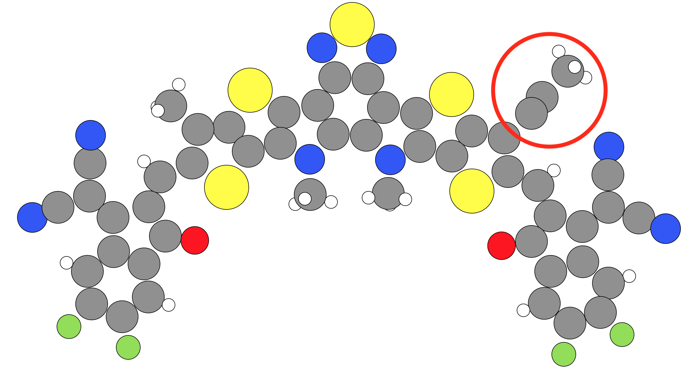

.. _Troubleshooting:

Issues and Troubleshooting
##########################

The following page includes some of the issues I have faced in using the Electronic Crystal Calculation Prep (ECCP) program and some of the tips and troubleshooting advice for overcoming various difficulties. 

Issues with removing aliphatic side-chains
******************************************

:Warning: Update hen when ACSD is sorted

This program is able to analyse a molecule for aliphatic side-chains and to remove them. If your aliphatic side-chains contain all the appropriate hydrogens it should, then there should be no issues. However, X-ray crystallography can miss out observing hydrogen atoms (due to poor electron density about some hydrogen atoms, disordered aliphatic side-chains, or other issues). In this case, sometimes the hydrogen atoms are not given on aliphatic side-chains. The Electronic Crystal Calculation Prep program does it best to identify aliphatic side-chains if hydrogens are no present. This is done by noting that sp3 carbons:

* Have four atoms around it, but if hydrogen are missing
* Noting that sp3 carbons often have bond angles between neighbours of up to 115° in angle
* sp3 C-C bond lengths are often greater than 1.3 Angstroms.

However, these are not hard and fast rules, and some sp3 carbons may have shorter bond lengths or wider bond angles due to the constraints and forces upon the side-chain in a crystal structure. In this case, you may find that some aliphatic side-chains are not removed automatically by this program.

An example of a molecule where one of the aliphatic side-chains has not been removed is show below. Here, the bond angle between C-C-C bonds is 120°, and the hydrogens were not given on these sp3 carbons.

**What to do if this happens to your crystal structure** --> There are two options you can pursue to overcome this problem: 

   1. Read the section on :ref:`manual_molecules` to see how to manually modify the molecules in your crystal to overcome this problem.
   2. Modify your crystal file manually. You can do this with ``.cif`` files using the ``Mercury`` program (https://www.ccdc.cam.ac.uk/solutions/csd-core/components/mercury/)

Other Issues
************

This program is definitely a "work in progress". I have made it as easy to use as possible, but there are always oversights to program development and some parts of it may not be as easy to use as it could be. If you have any issues with the program or you think there would be better/easier ways to use and implement things in the Electronic Crystal Calculation Prep program, feel free to email Geoffrey about these (geoffrey.weal@gmail.com). Feedback is very much welcome!

