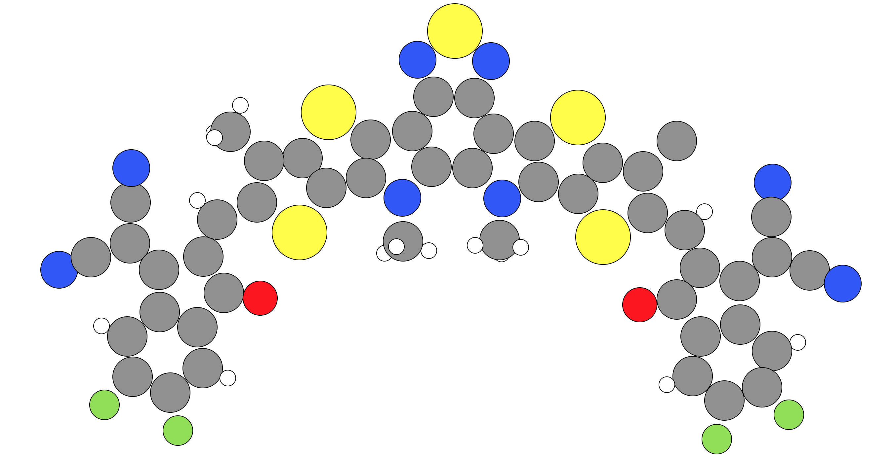
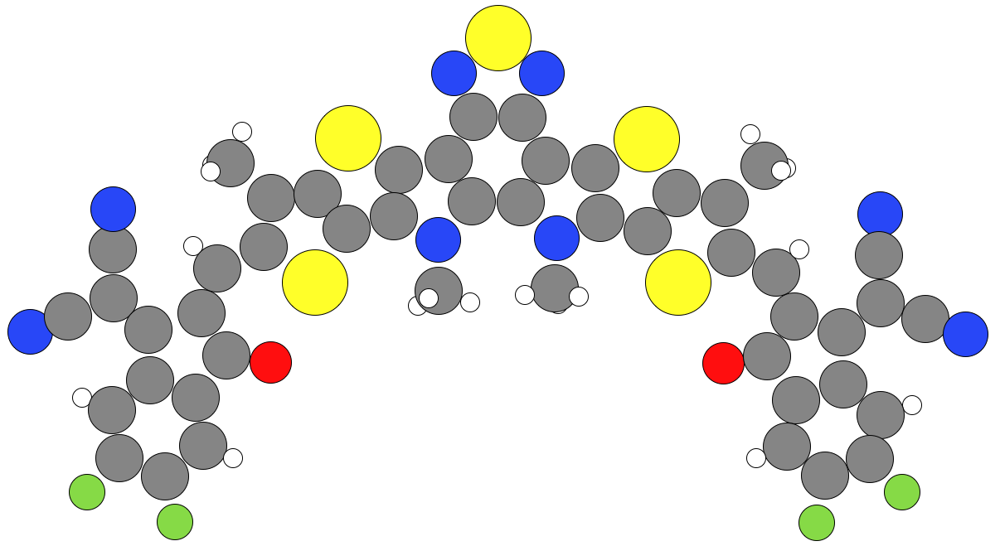

.. _manual_molecules:

Manually removing atoms in molecules in your crystal
####################################################

If you would like to remove atoms from molecules in your crystal manually to make your dimers (such as removing sidechains that will not affect the properties of your dimers significantly and make processing these crystals easier to do), then you will want to do the following: 

1. Run the ``ECCP`` program once by typing ``python Run_RCCP.py`` in the terminal where your ``Run_RCCP.py`` script is. If you have already done this, move on to step 2.
2. Open the ``ECCP_Data`` folder that has been created by ``ECCP`` and open the folder of the crystal you would like to modify the molecules of.
3. Rename the ``All_Molecules`` to ``Custom_Molecules``. This ``Custom_Molecules`` should contain all the molecules in the crystal as in the ``All_Molecules`` folder, even those molecules that you do not want to modify. 
4. For each molecule you want to modify, open the molecule's .xyz file and delete the atoms you want to delete. The ``ECCP`` program will replace any atoms that have been deleted with hydrogen atoms if needed automatically when you next run the ``ECCP`` program. For example, we would like to remove the carbon and hydrogen atoms that are attached to the alpha carbon in the image circled below: 

.. figure:: Images/aliphatic_sidechain_issue/made_structure.png
   :align: center
   :figwidth: 50%
   :alt: This is a blank ase gui screen that you would see if enter ``ase gui`` into the terminal.

5. Re-run the ``ECCP`` program again.
6. Open the newly created ``All_Molecules`` folder. You will now see your modified molecule that does not contain the atoms you deleted, but has included hydrogens that have been added where appropriate. See the example below:

NOTE: Only remove atoms you dont want from the molecule, do not move molecules. The Electronic Crystal Calculation Prep program is only designed to accept molecules with deleted atoms, not moved atoms.